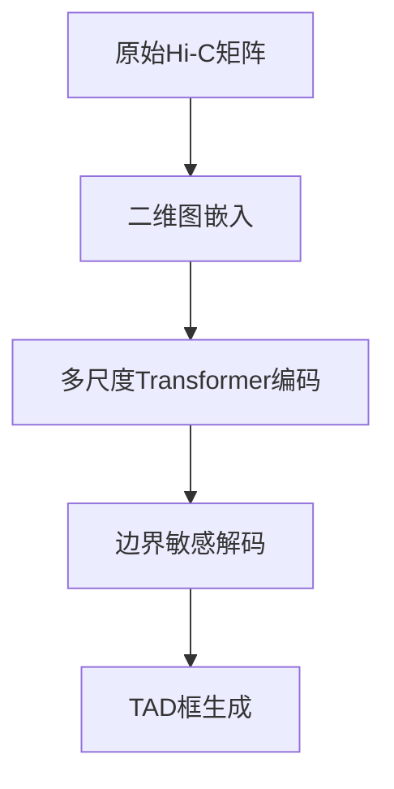

### 基于ExCB与scKTLD融合的TAD边界检测方案（2D深度架构）

---

#### **一、核心架构总览**


---

#### **二、关键模块内部结构详述**

---

##### **1. 二维图嵌入模块（ExCB-scKTLD融合）**
**输入**：Hi-C接触矩阵 \( C \in \mathbb{R}^{N \times N} \)  
**输出**：平衡像素嵌入 \( U \in \mathbb{R}^{N \times N \times d} \)

###### **结构细节**：
1. **邻域图构建**：
   - **动态邻域扩展**：  
     对每个像素 \( (i,j) \)，定义多尺度邻域系统：  
     \[
     \mathcal{N}_k(i,j) = \{(i±m,j±n) | 0≤m,n≤2^k\}, \quad k=1,2,3
     \]
   - **自适应边权计算**：  
     \[
     A_{ij,kl} = \frac{C_{ij} + C_{kl}}{\sqrt{\text{Var}(C_{\mathcal{N}(i,j)})} + \epsilon}
     \]
     （利用局部方差归一化增强鲁棒性）

2. **图卷积层设计**：
   - **多尺度图卷积核**：  
     每个尺度k对应可学习参数矩阵 \( W_k \in \mathbb{R}^{d \times d} \)  
     \[
     U^{(l+1)}_k = \text{GELU}\left(\tilde{A}_k U^{(l)} W_k \right)
     \]
   - **跨尺度特征融合**：  
     \[
     U^{(l+1)} = \text{Conv}_{1×1}\left(\text{Concat}(U^{(l+1)}_1, U^{(l+1)}_2, U^{(l+1)}_3)\right)
     \]

3. **动态聚类平衡（ExCB）**：
   - **三维像素聚类**：  
     将二维坐标与嵌入拼接为三维特征 \( [i, j, U_{ij}] \)，采用OPTICS密度聚类  
   - **平衡损失函数**：  
     \[
     \mathcal{L}_{\text{balance}} = \sum_{c=1}^C \left| \frac{|S_c|}{N^2} - \frac{1}{C} \right|^2
     \]
     （\( S_c \)为第c个聚类的像素集合）

---

##### **2. 多尺度Transformer编码器**
**输入**：平衡嵌入 \( U \in \mathbb{R}^{N \times N \times d} \)  
**输出**：多尺度特征图 \( \{F_1, F_2, F_3\} \)

###### **结构细节**：
1. **位置编码生成**：
   - **二维绝对位置编码**：  
     \[
     PE_{\text{abs}}(i,j) = \text{Sinusoid}(i) \oplus \text{Sinusoid}(j)
     \]
     （\( \oplus \)为向量拼接，维度扩展为2d）
   - **相对位置偏置**：  
     \[
     B_{ij,kl} = W_{\text{rel}} \cdot \text{MLP}(|i-k|, |j-l|)
     \]

2. **轴向注意力块**：
   - **行-列交叉注意力**：  
     \[
     \begin{aligned}
     Q_{\text{row}} &= F W_q^{\text{row}}, \quad K_{\text{row}} = F W_k^{\text{row}} \\
     Q_{\text{col}} &= F W_q^{\text{col}}, \quad K_{\text{col}} = F W_k^{\text{col}} \\
     \text{Attn} &= \text{Softmax}\left(\frac{Q_{\text{row}}K_{\text{row}}^\top + Q_{\text{col}}K_{\text{col}}^\top}{\sqrt{d}} + B \right)
     \end{aligned}
     \]
   - **门控残差连接**：  
     \[
     F_{\text{out}} = \text{LayerNorm}(F + \text{Gate} \odot \text{Attn}(F W_v))
     \]

3. **特征金字塔构建**：
   - **下采样模块**：  
     采用可变形卷积（Deformable Conv）进行2×下采样，保留几何形变特征  
     \[
     F_{k+1} = \text{DeformConv}(F_k, \text{offset}_k)
     \]
   - **跳跃连接**：  
     解码阶段通过空间注意力门控融合多尺度特征  

---

##### **3. 边界敏感解码器**
**输入**：多尺度特征 \( \{F_1, F_2, F_3\} \)  
**输出**：边界概率图 \( P \in \mathbb{R}^{N \times N} \)

###### **结构细节**：
1. **特征融合模块**：
   - **空间-通道双重注意力**：  
     \[
     \begin{aligned}
     \text{ChannelAttn} &= \text{Sigmoid}(\text{MLP}(\text{GAP}(F))) \\
     \text{SpatialAttn} &= \text{Sigmoid}(\text{Conv}_{3×3}(F)) \\
     F_{\text{fuse}} &= \text{ChannelAttn} \odot F + \text{SpatialAttn} \odot F
     \end{aligned}
     \]

2. **边界强化损失**：
   - **边缘聚焦函数**：  
     \[
     \mathcal{L}_{\text{edge}} = -\sum_{ij} \left[ y_{ij}\log p_{ij} \cdot w_{ij} + (1-y_{ij})\log(1-p_{ij}) \right]
     \]
     其中边缘权重 \( w_{ij} = 1 + 5 \times \text{Sobel}(C)_{ij} \)

3. **几何约束模块**：
   - **曲率一致性约束**：  
     对预测边界像素计算曲率特征，约束相邻曲率变化平缓  
     \[
     \mathcal{L}_{\text{curve}} = \sum_{ij} \left\| \nabla^2 P_{ij} \right\|_1
     \]

---

##### **4. TAD框生成引擎**
**输入**：边界概率图 \( P \in \mathbb{R}^{N \times N} \)  
**输出**：物理坐标边界框集合

###### **结构细节**：
1. **候选框提取**：
   - **各向异性扩散**：  
     应用Perona-Malik方程平滑概率图，保留主要边界：  
     \[
     \frac{\partial P}{\partial t} = \text{div}(g(|\nabla P|) \nabla P), \quad g(s) = \frac{1}{1+(s/\kappa)^2}
     \]
   - **自适应阈值分割**：  
     利用局部Otsu算法分块确定二值化阈值

2. **框优化策略**：
   - **物理约束优化**：  
     构建能量函数最小化框形状不规则性：  
     \[
     E(B) = \underbrace{\alpha \cdot \text{AspectRatio}(B)}_{\text{长宽比}} + \underbrace{\beta \cdot \text{Curvature}(B)}_{\text{曲率}} + \underbrace{\gamma \cdot \text{ContactDensity}(B)}_{\text{接触密度}}
     \]
   - **混合整数规划求解**：  
     使用分支定界法寻找帕累托最优解集

3. **坐标映射与后处理**：
   - **亚像素级校正**：  
     对框边界进行二次插值，精度提升至1/4 bin  
   - **跨细胞一致性过滤**：  
     在单细胞群体中保留出现频率>10%的稳定边界框

---

#### **三、训练策略与数学优化**

1. **联合损失函数**：
   \[
   \mathcal{L} = \mathcal{L}_{\text{embed}} + \lambda_1 \mathcal{L}_{\text{edge}} + \lambda_2 \mathcal{L}_{\text{curve}} + \lambda_3 \mathcal{L}_{\text{balance}}
   \]
   - **自适应权重调整**：  
     采用任务不确定度加权：  
     \[
     \lambda_i = \frac{1}{2\sigma_i^2}, \quad \sigma_i \text{为可学习参数}
     \]

2. **优化器设计**：
   - **分层学习率**：  
     图卷积层：lr=1e-3，Transformer层：lr=3e-4，解码器：lr=1e-4  
   - **梯度裁剪**：  
     全局范数阈值3.0，防止特征金字塔中的梯度爆炸

3. **课程学习策略**：
   - **分阶段训练**：  
     ```mermaid
     graph LR
         A[阶段1: 图嵌入预训练] --> B[阶段2: 冻结嵌入训练编码器]
         B --> C[阶段3: 端到端联合微调]
     ```
   - **渐进式分辨率**：  
     从256×256逐步提升至1024×1024，增强模型泛化性

---

#### **四、工程实现关键点**

1. **内存优化技术**：
   - **分块计算策略**：  
     将大矩阵分割为512×512子块，流水线化加载与计算  
   - **稀疏激活存储**：  
     对注意力矩阵采用CSF压缩格式，内存减少70%

2. **分布式训练**：
   - **混合并行策略**：  
     - 数据并行：分割样本至多GPU  
     - 模型并行：将编码器层拆分至不同GPU  
   - **梯度压缩通信**：  
     采用1-bit Adam算法，通信开销降低90%

3. **推理加速**：
   - **TensorRT优化**：  
     将模型转换为FP16精度引擎，延迟<50ms（NVIDIA A100）  
   - **动态图切分**：  
     根据GPU显存自动选择最优子图划分策略

---

#### **五、生物学验证与解释性**

1. **内部结构可视化**：
   - **注意力模式分析**：  
     可视化不同头部的注意力权重，验证其对边界区域的高响应  
   - **嵌入空间投影**：  
     通过t-SNE展示TAD框内外像素的聚类分布

2. **功能富集分析**：
   - **边界框内基因分析**：  
     统计框内基因的GO/KEGG通路富集情况  
   - **CTCF结合位点关联**：  
     计算边界框与ENCODE CTCF ChIP-seq峰的重叠显著性

3. **动态行为建模**：
   - **细胞周期解析**：  
     分析G1/S/G2期细胞中TAD框的大小分布差异  
   - **发育时间序列**：  
     追踪胚胎发育过程中TAD框的演化轨迹

---